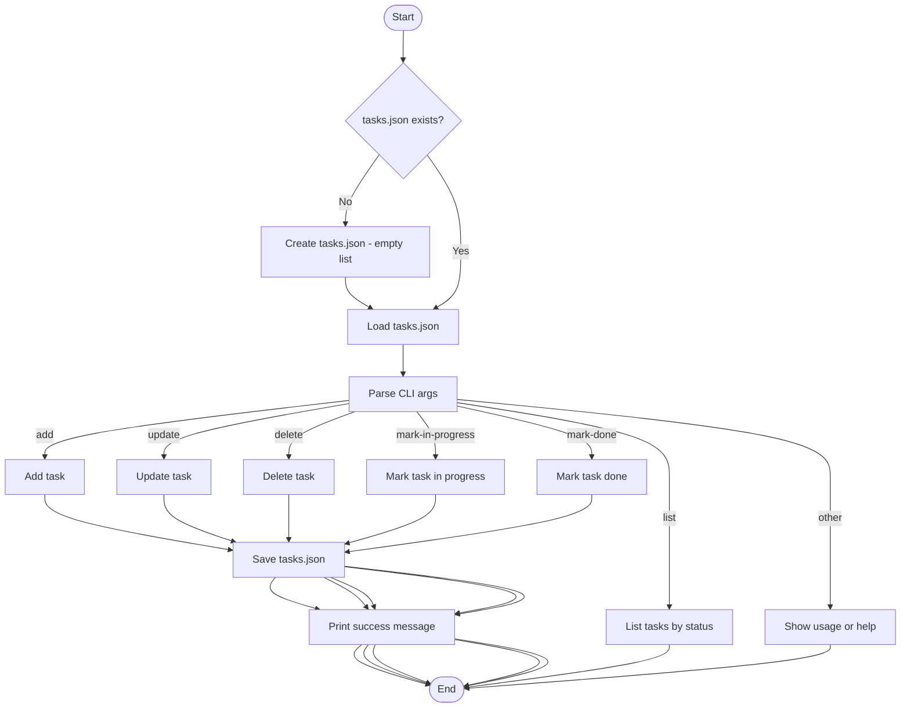

[README-with-flowchart.md](https://github.com/user-attachments/files/23359563/README-with-flowchart.md)
# Task Tracker CLI

A simple command-line Task Tracker that stores tasks in `tasks.json` in the current directory.
Each task has `id`, `description`, `status` (todo, in-progress, done), `createdAt`, and `updatedAt`.

---

## ⚙️ Usage examples

```bash
# Add a new task
python3 task-cli.py add "Buy groceries"

# Update a task
python3 task-cli.py update 1 "Buy groceries and cook dinner"

# Delete a task
python3 task-cli.py delete 1

# Mark status
python3 task-cli.py mark-in-progress 1
python3 task-cli.py mark-done 1

# List tasks
python3 task-cli.py list
python3 task-cli.py list done
python3 task-cli.py list todo
python3 task-cli.py list in-progress
```

---

## 🧭 Task Tracker Flowchart

Below is the complete program flowchart rendered in Mermaid (supported directly in GitHub README files):



---

## 📦 GitHub upload (quick steps)

```bash
git init
git add .
git commit -m "Initial commit: Task Tracker CLI"
git branch -M main
git remote add origin https://github.com/<username>/<repo>.git
git push -u origin main
```

---

## 🧠 Notes

- Uses only the Python standard library.
- Put `tasks.json` in `.gitignore` so local task data doesn’t get committed.
- Works on Linux, macOS, and Windows (with Python 3.7+).
